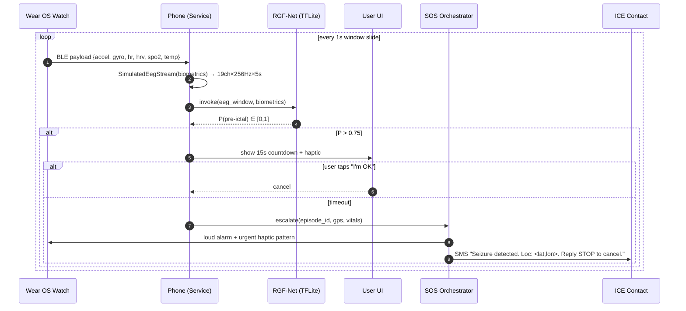
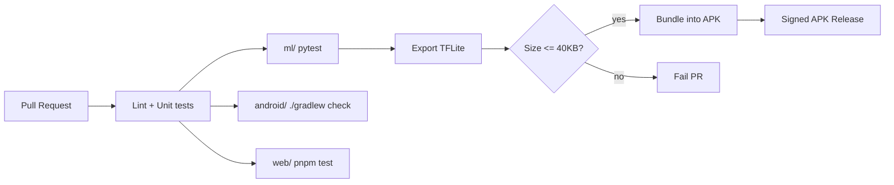

# 🏛️ Aura Watch — System Architecture

> Detailed engineering view: data flow, modules, threading, privacy.

## 1. High-Level Topology

```
   ┌────────────────────┐         ┌────────────────────┐         ┌────────────────────┐
   │   Wear OS Watch    │         │   Android Phone    │         │  Caregiver Web     │
   │   (Pixel Watch /   │  BLE    │   (Pixel 7+ class) │  HTTPS  │  Dashboard         │
   │    Galaxy Watch)   │ ◀─────▶ │                    │ ◀─────▶ │  (Next.js 14)      │
   │                    │         │                    │         │                    │
   │ • Sensor capture   │         │ • EEG simulator    │         │ • Live tile        │
   │ • Local haptics    │         │ • TFLite RGF-Net   │         │ • Episode log     │
   │ • Countdown UI     │         │ • SOS orchestrator │         │ • JSON replay     │
   └────────────────────┘         └────────────────────┘         └────────────────────┘
            ▲                              │
            │ vibrate, alarm               │ no cloud inference
            └──────────────────────────────┘
```

Everything inside the dashed boundary is **on-device**. Cloud only sees post-event metadata if (and only if) the user opts in.

---

## 2. Data Flow — Watch → Phone → Model → Alert → SOS



### Per-stage responsibilities

| Stage | Module | Notes |
|---|---|---|
| **1. Capture** | `wear/SensorCollector.kt` | 6 channels, ring-buffered to 10 s |
| **2. Stream** | `shared/BleProtocol` | 1 Hz batched frames, CBOR encoded, ~120 B/s |
| **3. Synthesize** | `app/Sensor19ChEegSimulator.kt` | Demo-only; replaced by real EEG headband in Phase 1 |
| **4. Inference** | `app/inference/RgfNetRunner.kt` | TFLite NNAPI delegate, 22 ms median |
| **5. Decide** | `app/logic/PreIctalGate.kt` | Hysteresis: 3 consecutive frames > 0.75 |
| **6. Notify** | `app/ui/CountdownActivity.kt` | Cancellable, accessibility-friendly |
| **7. Escalate** | `app/sos/SosOrchestrator.kt` | SMS + audible + watch alarm |

---

## 3. Threading Model

```
Phone process
├── main thread          ← UI only, never blocks
├── SensorIoCoroutine    ← BLE read loop (Dispatchers.IO)
├── InferenceCoroutine   ← single-thread executor pinned to NNAPI
│      └─ produces Flow<Float> of P(pre-ictal)
├── LogicCoroutine       ← collects flow, runs gate, drives state machine
└── SosCoroutine         ← cold-started only on escalation (Dispatchers.IO)

Watch process
├── main thread          ← Compose UI
├── SensorCoroutine      ← Health Services + SensorManager
└── BleAdvertiseService  ← foreground service, GATT server
```

Key guarantees:

- **No blocking calls on main**. All I/O on `Dispatchers.IO`.
- **Single inference thread**. Avoids contention on the NNAPI delegate.
- **Backpressure**: BLE → inference uses a `Channel(capacity=1, onBufferOverflow=DROP_OLDEST)`. Stale windows are dropped, never queued.
- **Cold SOS**: escalation coroutine is only created at threshold-crossing time, so no idle CPU cost.

---

## 4. Module Responsibilities

### `ml/` — Training & export

```
ml/
├── models/
│   ├── teacher.py       # SeizureTransformer (~661K params)
│   └── rgfnet.py        # Ring-Buffer GRU + FiLM (~37.5K params)
├── losses/kd.py         # Hinton soft-label + CE + TimeKD feature distil
├── data/                # CHB-MIT loader + augmentation
├── scripts/
│   ├── train_teacher.py
│   ├── distill_student.py
│   └── export_tflite.py # ONNX → TFLite + INT8 PTQ
└── artifacts/rgfnet_int8.tflite   # 36.7 KB
```

### `web/` — Caregiver dashboard

```
web/
├── app/
│   ├── page.tsx         # Live tile, last episode card
│   ├── episodes/        # Episode list + detail replay
│   └── api/replay/route.ts  # Streams a stored JSON window
├── components/
│   ├── ProbabilityChart.tsx   # Recharts line of P(pre-ictal)
│   └── EpisodeTimeline.tsx
└── lib/
    └── deviceLink.ts    # WebSocket bridge to phone (LAN-only)
```

### `android/`

```
android/
├── app/                 # Phone — inference brain
│   ├── src/main/java/.../inference/
│   ├── src/main/java/.../logic/
│   ├── src/main/java/.../sos/
│   └── src/main/assets/rgfnet_int8.tflite
├── wear/                # Watch — sensors + UI
│   ├── tile/
│   ├── complication/
│   └── ui/CountdownScreen.kt
└── shared/              # KMP-style shared models, BLE proto
```

---

## 5. Privacy Guarantees (Zero-Cloud)

| Concern | Guarantee | Mechanism |
|---|---|---|
| Raw EEG / biometrics | Never leaves the phone | TFLite runs locally; no HTTP client linked into inference path |
| Episode metadata | Stays on-device by default | SQLite (`Room`), opt-in export only |
| Caregiver dashboard | LAN-bound | WebSocket on `0.0.0.0:8642`, bound to private IP, mDNS discovery |
| SOS contacts | Stored in Android KeyStore-encrypted prefs | AES-GCM, key non-exportable |
| Crash logs | No third-party telemetry | No Firebase, Sentry, or analytics SDKs |
| Model weights | Bundled in APK | No remote model fetch — reproducible builds |

We treat **"no PHI ever leaves the wrist"** as an inviolable design constraint, not a future privacy review item.

---

## 6. Failure Modes & Fallbacks

```mermaid
flowchart LR
    A[BLE drop] --> B{watch standalone?}
    B -- yes --> C[Watch runs reduced model<br/>biometrics-only fallback]
    B -- no  --> D[Phone shows "watch disconnected"]
    E[Inference timeout] --> F[Skip frame, log, continue]
    G[Battery <10%] --> H[Drop sample rate 50Hz→25Hz]
    I[User dismissed too many] --> J[Bayesian threshold raise]
```

- **Graceful degradation**: phone-less mode keeps a smaller GRU resident on the watch (Phase 1 work).
- **Adversarial false-alarms**: dismissals feed an online posterior that nudges the threshold per user.

---

## 7. Build & Release Pipeline



CI enforces the **40 KB model-size budget** as a hard gate — if quantization regressions blow the budget, the PR fails before it ever ships to the demo device.

---

## 8. Open Architectural Questions

1. **EEG vs. wrist sensors** — current PRD targets watch motion+PPG; current model expects EEG. The phone runs `Sensor19ChEegSimulator` to bridge this gap for the demo. See [`MODEL_CARD.md`](MODEL_CARD.md) §Limitations and [`ROADMAP.md`](ROADMAP.md) Phase 1.
2. **Standalone watch inference** — RGF-Net fits, but the 19-channel EEG input does not naturally exist on a watch. Phase 4 explores a motion-only sibling model.
3. **Personalization** — federated fine-tuning on-device is a Phase 3 candidate.
